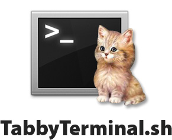

==================

A small shell script to give you more control over tabs in Terminal.app

Allows you to run a command to open a new tab in your current working directory or a directory you specify. Also allows for passing commands to be run immediately in the new tab. 

Installing
----------

To install TabbyTerminal, open a terminal window and run this command:

	curl https://raw.github.com/adammiller/TabbyTerminal/master/install.sh | sh
	
As always, you should [install_script][review the install] script before you run it.
[install_script]: https://raw.github.com/adammiller/TabbyTerminal/master/install.sh

After you install, the output will prompt you to setup an alias. The rest of these instructions assume you use the `new` alias as suggested in the output. It's totally up to you what command you choose; just substitute your chosen alias for `new` in the usage instructions. 

Usage
-----

Tabby Terminal is flexible, and allows you to string on just about any command. If the first argument is a directory, your new terminal tab will start in that directory. 

	new [path] [command]

Examples of use
---------------

Run it without any arguments to open a new tab in your current working directory

	new 

Run it specifying the directory you'd like your new tab to start in

	new ~/Sites/my-blog

Pass it before a command you'd like to be run immediately in the new tab

	new rails server
	
Or go for the gusto and pass a directory and a command 

	new django_app manage.py activate

License
-------

http://unlicense.org/ - i.e. do what you want with it.

